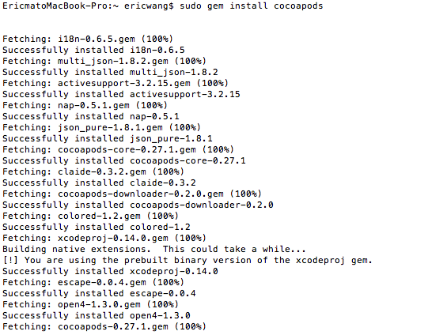
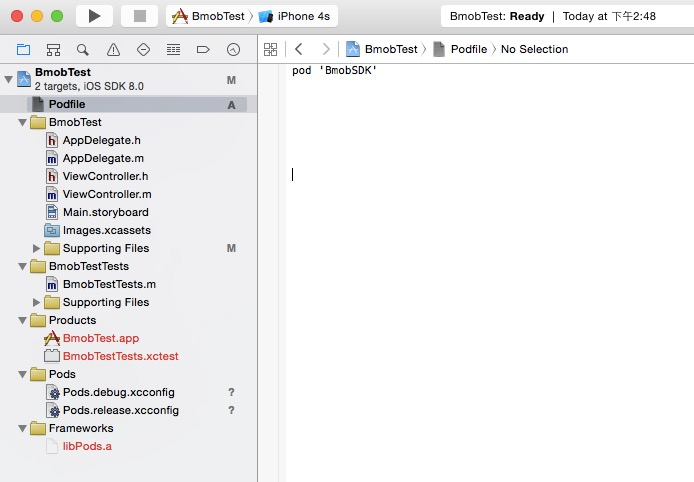
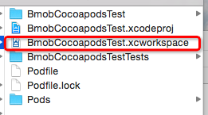

# Bmob iOS SDK

---

## 简介

Bmob iOS SDK 是一套高效、易用的移动后端云服务开发工具包，助力开发者快速集成数据存储、用户管理、文件存储、云函数等后端能力。SDK 支持多架构，兼容主流 iOS 版本，适用于各类 iOS 应用开发场景。

---

## 主要特性

- 数据存储与查询
- 用户注册、登录与管理
- 文件上传与下载
- 云函数调用
- 推送通知
- 权限与角色管理
- 多架构支持（arm64、x86_64 等）
- 完善的错误处理与回调机制

---

## 安装方式

### 1. 使用 CocoaPods 安装（推荐）

CocoaPods 是 iOS 最常用的依赖管理工具，可以极大简化第三方库的集成和升级流程。

#### 安装 CocoaPods

如未安装 CocoaPods，请先在终端执行：

```bash
sudo gem install cocoapods
```

如遇网络问题，可更换 Ruby 镜像源（如淘宝源），或参考[官方文档](http://code4app.com/article/cocoapods-install-usage)。

#### 集成 BmobSDK

1. 在你的项目根目录下新建 `Podfile` 文件，内容如下（`bmob202603` 替换为你的项目名）：

```ruby
platform :ios, '15.6'  # 指定平台和最低支持版本
target 'bmob202603' do
  pod 'BmobSDK'
end
```

2. 终端进入项目根目录，执行：

```bash
pod install
```

3. 安装完成后，使用 `.xcworkspace` 文件打开项目，即可在项目中使用 BmobSDK。





---

### 2. 手动集成

- 下载并解压本 SDK。
- 将 `BmobSDK.xcframework` 拖入 Xcode 项目，勾选"Copy items if needed"。
- 在 `Build Phases` 的 `Link Binary With Libraries` 中添加所需依赖库。

---

## 3. Swift 工程集成说明

如需在 Swift 项目中使用 BmobSDK，请创建桥接头文件 `BmobSwift-Bridging-Header.h`，并在其中添加：

```objc
#import <BmobSDK/Bmob.h>
```

然后在 Xcode 的 Build Settings 中，将 `Objective-C Bridging Header` 设置为该文件的路径（如 `$(SRCROOT)/YourProject/BmobSwift-Bridging-Header.h`）。

---

## Swift 代码调用示例

在 Swift 项目中集成 BmobSDK 后，可按如下方式调用：

#### 1. 初始化 SDK

```swift
import UIKit

@UIApplicationMain
class AppDelegate: UIResponder, UIApplicationDelegate {
    func application(_ application: UIApplication, didFinishLaunchingWithOptions launchOptions: [UIApplication.LaunchOptionsKey: Any]?) -> Bool {
        Bmob.register(withAppKey: "Your_App_Key")
        return true
    }
}
```

#### 2. 数据操作示例

```swift
let gameScore = BmobObject(className: "GameScore")
gameScore?.setObject(1337, forKey: "score")
gameScore?.setObject("Sean Plott", forKey: "playerName")
gameScore?.saveInBackground({ (isSuccessful, error) in
    // 处理结果
})
```

---

## 快速入门

如需详细入门教程，请参考 [Bmob iOS 快速入门文档](http://doc.bmobapp.com/data/ios/index.html)。

#### 1. 初始化 SDK

```objc
#import <BmobSDK/Bmob.h>

- (BOOL)application:(UIApplication *)application didFinishLaunchingWithOptions:(NSDictionary *)launchOptions {
    [Bmob registerWithAppKey:@"Your_App_Key"];
    return YES;
}
```

#### 2. 数据操作示例

```objc
// 新增对象
BmobObject *gameScore = [BmobObject objectWithClassName:@"GameScore"];
[gameScore setObject:@1337 forKey:@"score"];
[gameScore setObject:@"Sean Plott" forKey:@"playerName"];
[gameScore saveInBackgroundWithResultBlock:^(BOOL isSuccessful, NSError *error) {
    // 处理结果
}];
```

更多用法请参考[官方文档](https://doc.bmob.cn/ios/quickstart/)

---

## 文档与支持

- [快速入门](https://doc.bmob.cn/ios/quickstart/)
- [开发文档](https://doc.bmobapp.com/data/ios/develop_doc/)
- 官方网站：[https://www.bmobapp.com/](https://www.bmobapp.com/)
- 技术支持邮箱：730170034@qq.com
- [工单系统]

---

## 许可证

本项目遵循 MIT License，详见 LICENSE 文件。

---

## 更新历史（最近 20 条）

- v2.5.625 (2015-06-25)
  1. 修复一些情况下后端文件域名绑定新域名客户端如果不重新安装 App 还是返回缓存旧域名问题
  2. 云函数调用服务端返回自定义特殊字符极端情况下可能陷入死循环问题
- v2.5.61 (2015-06-1)
  1. sdk 最低支持版本 IOS 15.6
  2. 新增 BmobSDK.xcframework 的脚本
  3. 打包格式正式切换为 xcframework 新格式
- v2.4.3 (2014-10-25)
  1. 上一个版本2.4.21，打包 bug 只支持 arm 架构真机，新版本支持多架构
  2. CC_MD 最高支持 iOS 13，将 CC_MD5 替换为 CC_SHA256
- v2.4.21 (2014-09-09)
  1. 默认域名 cctvcloud.cn
- v2.4.2 (2019-09-09)
  1. 修复 ios 官方时间错误问题
- v2.4.0 (2019-09-09)
  1. 修改了 SDK 内部域名相关，方便开发者测试期间有测试域名
- v2.4.2 (2022-05-07)
  1. 修复 iOS15.4 之后，字段格式为 NSDate 时，上传对象出错
- v2.4.0 (2019-09-09)
  1. 修改了 SDK 内部域名相关，方便开发者后续切换主域名
- v2.3.4 (2019-06-26)
  1. 修复了使用文件独立域名的情况下，部分用户无法上传文件的问题
  2. 修复了文件上传失败回调不准确的问题
  3. 修复了部分文件上传时 Content-Type 错误的问题
  4. 针对部分 DNS 被劫持的环境提高了兼容性
- v2.3.3 (2019-03-28)
  1. 将文件上传由分块上传改为断点续传
- v2.3.2 (2019-03-14)
  1. 修改请求域名，解决新疆等地区 DNS 被劫持的问题
  2. 修复了一些小的兼容性问题
  3. 防攻击加强
- v2.3.1 (2018-04-17)
  1. 支持上传较大的文件
- v2.3.0 (2018-04-11)
  1. 修复 bug
- v2.2.9 (2018-04-08)
  1. 修复上传文件过大导致 crash 的 bug
- v2.2.8 (2017-12-08)
  1. 修复 bug
- v2.2.7 (2017-12-04)
  1. 修复 bug
  2. 添加 QQ 支付功能
- v2.2.6 (2017-11-22)
  1. 修复 bug
- v2.2.5 (2017-11-20)
  1. 修复支付宝
- v2.2.4 (2017-10-25)
  1. 恢复支付宝功能
- v2.2.3 (2017-09-04)
  1. 修复 bug

更多历史版本变更请查看 [Bmob_iOS_SDK更新历史.txt](./Bmob_iOS_SDK更新历史.txt)。

